# 📚 WordMaster

**Тренажёр иностранных слов с колодами карточек, интервальными повторениями и геймификацией**

> Учи слова, создавай свои колоды, делись ими с другими и наблюдай, как растёт словарный запас.
> Алгоритм SM-2 сам решает, когда показать слово снова, — ровно перед тем, как ты его забудешь.


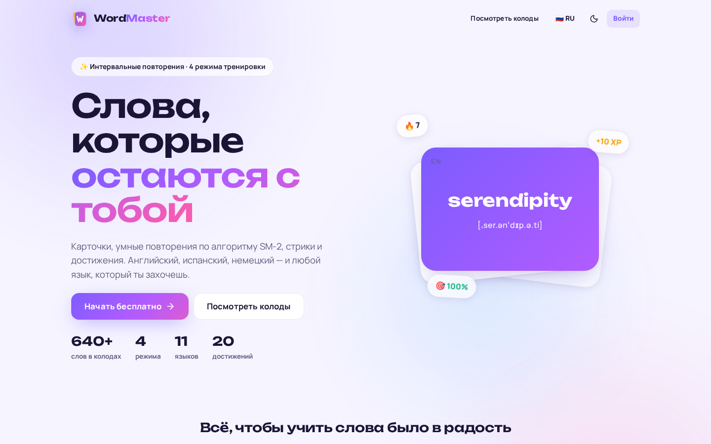

---

## 📖 Содержание

- [О проекте](#-о-проекте)
- [Возможности](#-возможности)
- [Скриншоты](#-скриншоты)
- [Технологический стек](#️-технологический-стек)
- [Быстрый старт](#-быстрый-старт)
- [Архитектура](#️-архитектура)
- [Модель данных](#️-модель-данных)
- [Как работает обучение](#-как-работает-обучение)
- [API](#-api)
- [Структура проекта](#-структура-проекта)
- [Тесты](#-тесты)
- [Дорожная карта](#️-дорожная-карта)

---

## 🎯 О проекте

**WordMaster** — веб-приложение для изучения иностранных слов (английский, испанский, немецкий и любые другие языки)
с помощью карточек, объединённых в колоды.

1. Пользователь создаёт **колоду** (например, «Слова из сериала Friends») или копирует готовую из **каталога**.
2. Наполняет её **карточками**: слово, перевод, транскрипция, пример, картинка — вручную или **импортом списка**.
3. Тренируется в одном из **четырёх режимов**: карточки, ввод ответа, выбор из вариантов, аудирование.
4. Алгоритм **SM-2** планирует повторения, а приложение считает **опыт, уровни, серию дней и достижения**.
5. Колоду можно сделать **публичной** — её найдут, лайкнут и скопируют другие.

Проект задуман как **учебный**: на нём отрабатывается связка **Java + Spring Boot + PostgreSQL + Vue** на
реалистичной предметной области — аутентификация, права доступа к чужим данным, агрегирование статистики,
миграции, тесты на реальной БД и контейнеризация.

## ✨ Возможности

### 🧠 Обучение

- **4 режима тренировки**:
  - 🃏 *Карточки* — 3D-переворот, самооценка «Не помню / Трудно / Хорошо / Легко», свайпы на телефоне;
  - ⌨️ *Ввод ответа* — сервер проверяет ответ, прощая регистр, «ё/е», пунктуацию, варианты через запятую и опечатки;
  - ✅ *Выбор* — 4 варианта из той же колоды;
  - 🎧 *На слух* — слово произносится синтезатором речи, нужно его написать.
- **Направление**: слово → перевод или перевод → слово.
- **Подбор карточек**: умный (сначала пора повторить, затем новые), все вперемешку, только трудные.
- **Интервальные повторения SM-2**: интервал, ease factor, статусы «новое → изучаю → выучено».
- **Озвучка** через Web Speech API (бесплатно, работает в браузере), настройка скорости и автопроизношения.
- Горячие клавиши: `Space` — перевернуть, `1–4` — оценка/вариант, `Enter` — дальше, `Esc` — выход.

### 🔥 Геймификация

- **Опыт (XP)** за каждый ответ (сложные режимы дают больше), бонусы за завершение и идеальный раунд.
- **Уровни**, **цель дня** (настраивается), **серия дней** с огоньком, **комбо** правильных ответов.
- **20 достижений**: от «Первые шаги» до «Ходячий словарь» и «Бриллиант» (100 дней подряд).
- Итоги раунда с конфетти: точность, время, опыт, продление серии, новые достижения.

### 📚 Колоды и каталог

- Свои колоды: эмодзи-иконка, цвет, языки, теги, публичность.
- **8 стартовых колод (640 карточек)**: неправильные глаголы, фразовые глаголы, Top-200 слов, идиомы,
  английский для IT, английский в путешествии, первые слова испанского и немецкого.
- Каталог: поиск, фильтры по языку и тегам, сортировка, «только официальные», предпросмотр карточек.
- Копирование в один клик (копия независима от оригинала), лайки.
- **Импорт** списка слов: разделители `Tab`, `;`, ` - `, `|`, `=` определяются автоматически.

### 📊 Статистика

- Тепловая карта активности за полгода, прогноз повторений на 2 недели.
- Выучено / в процессе / точность / тренировки / лучшая серия.
- Трудные слова (наибольшая доля ошибок), **слово дня**.

### 🎨 Интерфейс

- Светлая и тёмная темы (или как в системе), **RU / EN** интерфейс.
- Адаптивность: сайдбар на десктопе, таб-бар на телефоне. **PWA** — можно установить на главный экран.
- Админка: пользователи и роли, языки, теги.

## 📸 Скриншоты

| Главная (тёмная тема) | Колода |
|---|---|
| 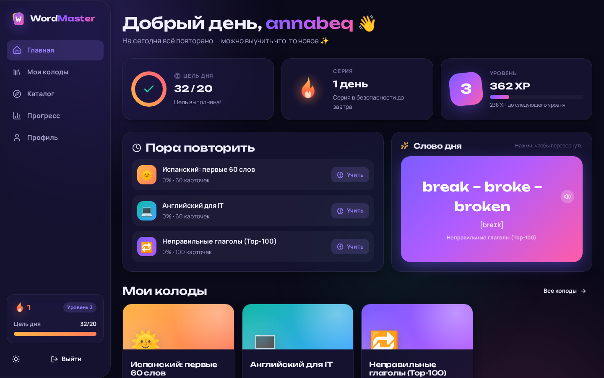 | 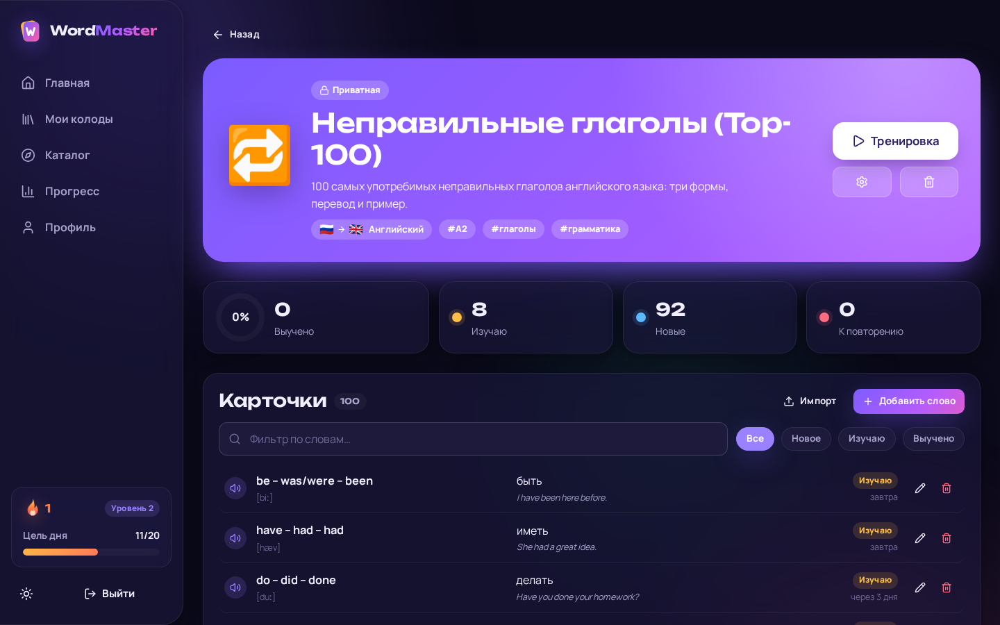 |
| **Тренировка: карточки** | **Тренировка: ввод ответа** |
| 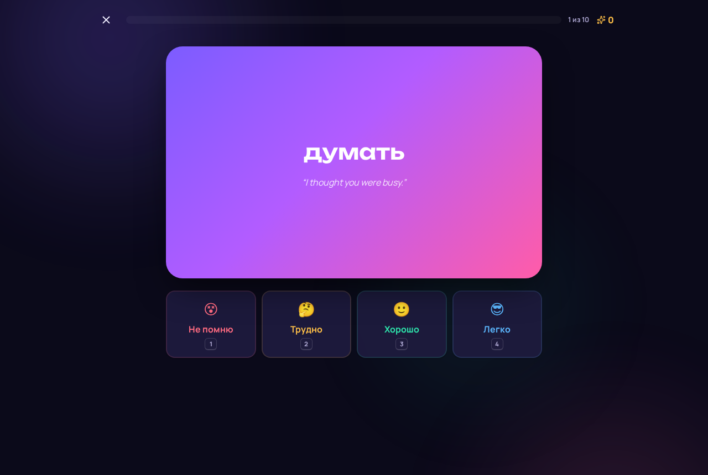 | 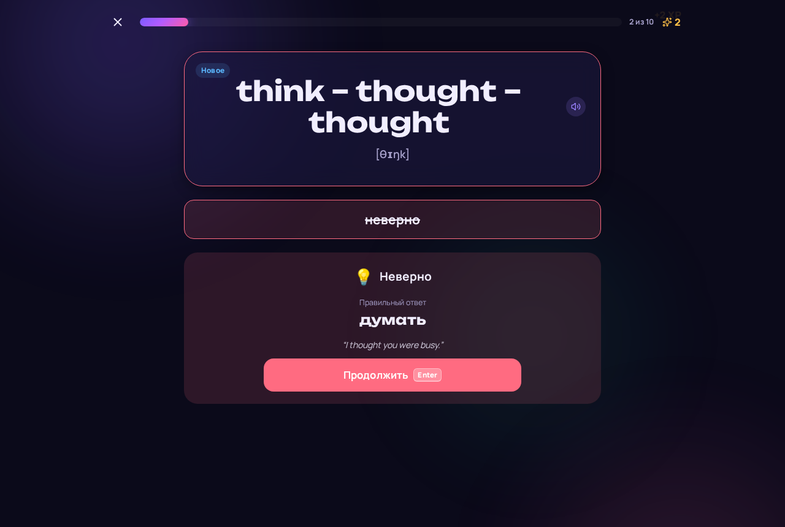 |
| **Настройка тренировки** | **Итоги раунда** |
| 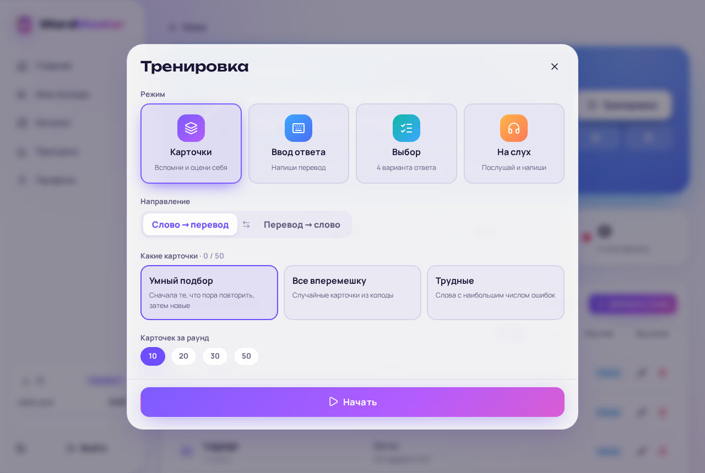 | 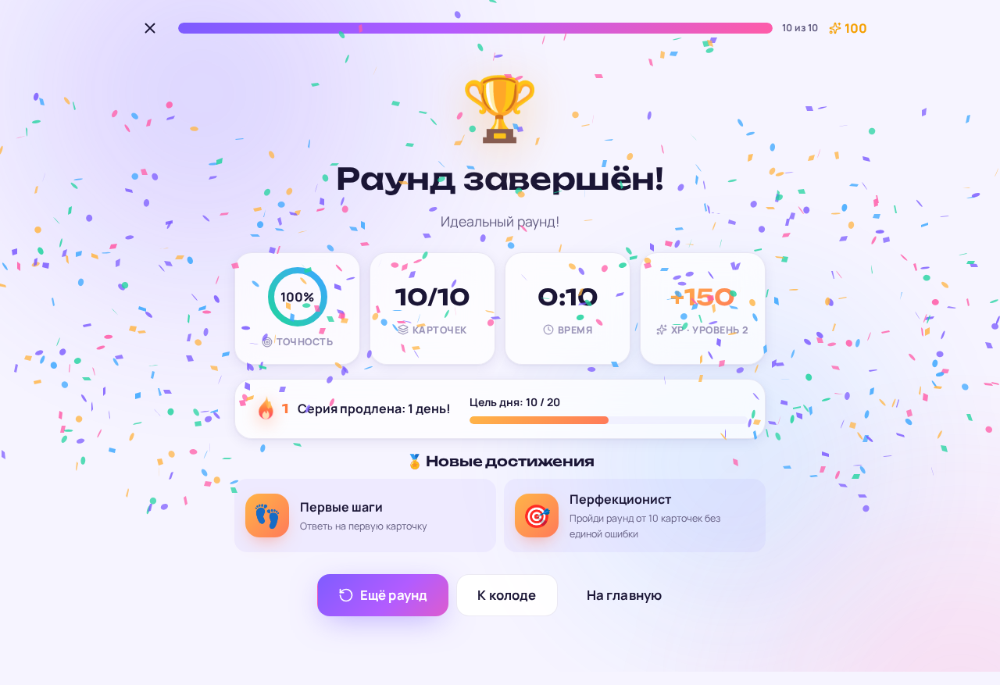 |
| **Прогресс** | **Мобильная версия** |
| 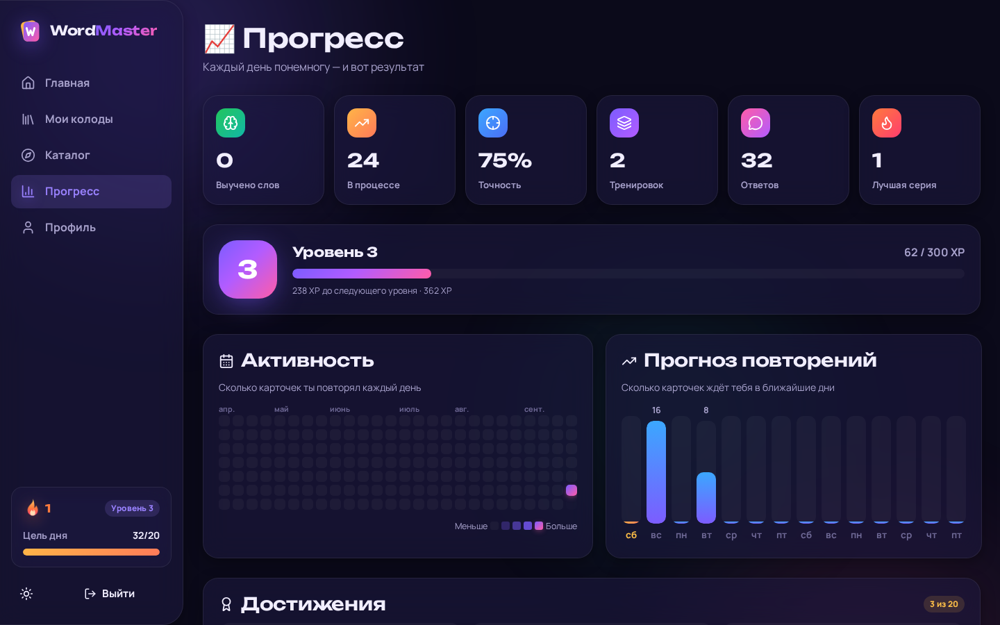 | 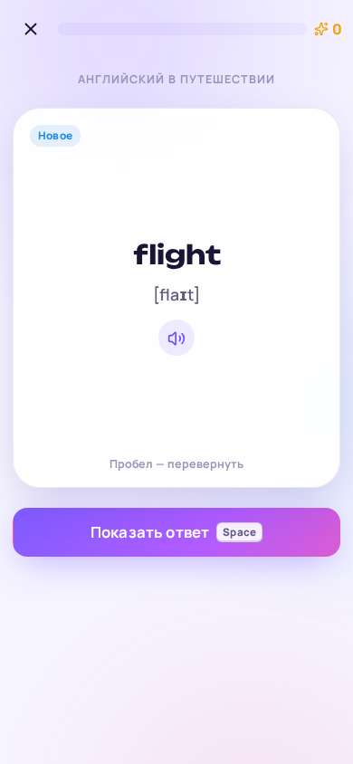 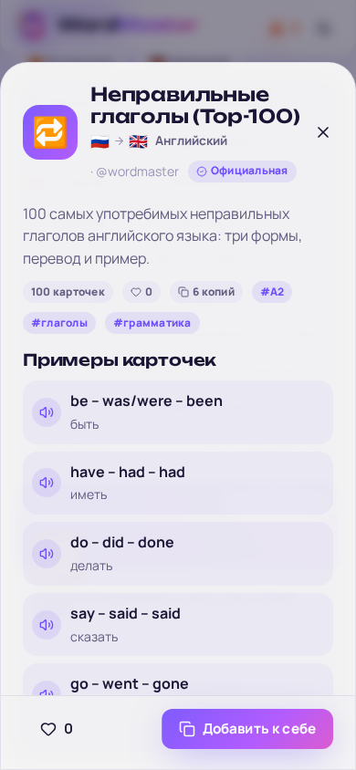 |

---

## 🛠️ Технологический стек

### Бэкенд

| Технология                              | Назначение                                                  |
|-----------------------------------------|-------------------------------------------------------------|
| **Java 25**                             | Основной язык                                               |
| **Spring Boot 4.1** (Web MVC)           | Каркас приложения, REST API                                 |
| **Spring Data JPA / Hibernate**         | Репозитории, Specifications для каталога                    |
| **Spring Security + OAuth2 Resource Server** | JWT (HS256) access-токены + refresh-токены в БД        |
| **Bean Validation**                     | Валидация DTO и контрактов сервисов                         |
| **PostgreSQL 17**                       | Реляционная СУБД                                            |
| **Liquibase**                           | Миграции схемы и seed-данные (языки, теги, стартовые колоды) |
| **MapStruct + Lombok**                  | Маппинг Entity ↔ DTO, сокращение шаблонного кода            |
| **springdoc-openapi**                   | Swagger UI                                                  |
| **JUnit 5, Mockito, Testcontainers**    | Unit- и интеграционные тесты на настоящем PostgreSQL        |

### Фронтенд

| Технология                     | Назначение                                     |
|--------------------------------|------------------------------------------------|
| **Vue 3** (Composition API) + **TypeScript** | SPA                              |
| **Vite**                       | Сборка и dev-сервер с прокси на API            |
| **Pinia**, **Vue Router**      | Состояние и маршрутизация                      |
| **vue-i18n**                   | Русский и английский интерфейс                 |
| **VueUse**, **lucide-vue-next**, **canvas-confetti** | Утилиты, иконки, праздничное конфетти |
| **vite-plugin-pwa**            | Установка как приложение                       |
| **Vitest**                     | Тесты утилит                                   |

Дизайн написан вручную на CSS-переменных (без UI-фреймворков): «стеклянные» поверхности, анимированный фон,
пружинные анимации, шрифты *Unbounded* и *Manrope*.

### Инфраструктура

- **Docker / docker-compose**: PostgreSQL + backend + frontend (nginx раздаёт SPA и проксирует `/api`), запуск одной командой.
- **Docker Hub**: образы публикуются автоматически после merge в `main`.
- **GitHub Actions**: сборка и тесты бэкенда, тесты и сборка фронтенда, сборка и публикация Docker-образов.

---

## 🚀 Быстрый старт

### Вариант 1. Одной командой (Docker)

Нужен только Docker. Скачайте [`docker-compose.yml`](docker-compose.yml) (или клонируйте репозиторий) и выполните:

```bash
docker compose up -d
```

Откройте **http://localhost** — вход администратора: **admin / admin12345**. Swagger: http://localhost/swagger-ui.html

Образы берутся из Docker Hub и проверяются на обновление при каждом запуске, поэтому после выхода новой версии
достаточно снова выполнить `docker compose up -d`. Данные хранятся в томе `db-data` и переживают обновления.
Порт, пароли, секрет JWT и версию образов можно переопределить в `.env` (шаблон — [`.env.example`](.env.example)).

> ⚠️ Для сервера, доступного из интернета, обязательно задайте свои `JWT_SECRET`, `ADMIN_PASSWORD` и `DB_USER_PASSWORD`.

Собрать образы из исходников вместо Docker Hub:

```bash
docker compose -f docker-compose.yml -f docker-compose.build.yml up -d --build
```

### Вариант 2. Локальная разработка

Нужны **JDK 25**, **Node.js 22+** и PostgreSQL (свой или из Docker).

```bash
# 1. База данных (если нет своей; иначе создайте её скриптом extra/create_dev_db.sql)
docker compose -f docker-compose.dev.yml up -d

# 2. Бэкенд (профиль dev, http://localhost:8080)
mvn spring-boot:run

# 3. Фронтенд (http://localhost:5173, /api проксируется на 8080)
cd frontend
npm install
npm run dev
```

В профиле `dev` автоматически создаётся администратор **admin / admin12345**.

### Публикация новых версий

Образы `wordmaster-backend` и `wordmaster-frontend` собирает GitHub Actions ([`ci.yml`](.github/workflows/ci.yml)):

- в pull request — только сборка и тесты, ничего не публикуется;
- после **merge в `main`** — образы (amd64 + arm64) публикуются в Docker Hub с тегами `latest` и `sha-<коммит>`;
- тег `v1.2.3` — дополнительно версия `1.2.3`.

Однократная настройка (Settings → Secrets and variables → Actions):

| Где | Имя | Значение |
|-----|-----|----------|
| Variables | `DOCKERHUB_USERNAME` | логин Docker Hub |
| Secrets | `DOCKERHUB_TOKEN` | Access Token Docker Hub (Account settings → Personal access tokens, права *Read & Write*) |

Откатиться на любую прошлую версию: `WORDMASTER_VERSION=sha-1a2b3c4 docker compose up -d`.

### Переменные окружения

| Переменная              | По умолчанию                 | Описание                                         |
|-------------------------|------------------------------|--------------------------------------------------|
| `DB_HOST` / `DB_PORT`   | `localhost` / `5432`         | Адрес PostgreSQL                                 |
| `DB_NAME`               | `WORDMASTER`                 | Имя базы                                         |
| `DB_USER_NAME` / `DB_USER_PASSWORD` | `word_master_user` / `password` | Учётные данные БД                      |
| `JWT_SECRET`            | тестовый (смените на сервере) | Секрет подписи токенов, минимум 32 символа       |
| `ADMIN_USERNAME` / `ADMIN_EMAIL` / `ADMIN_PASSWORD` | пусто | Администратор, создаваемый при старте     |
| `APP_TIME_ZONE`         | `Europe/Moscow`              | Часовой пояс, по которому считаются дни и серии  |
| `CORS_ALLOWED_ORIGINS`  | `http://localhost:5173`      | Разрешённые origin'ы для фронтенда               |
| `APP_PORT`              | `80`                         | Публичный порт в docker-compose                  |
| `DOCKERHUB_NAMESPACE` / `WORDMASTER_VERSION` | `aslelin` / `latest` | Откуда брать образы и какую версию      |

---

## 🏗️ Архитектура

```
 Vue SPA ──HTTP/JSON──▶ Controller ──▶ Service ──▶ Repository ──▶ PostgreSQL
 (Pinia,               (DTO, валидация)  (бизнес-логика,   (Spring Data JPA,
  JWT в заголовке)                        SM-2, XP, права)   Specifications)
                                  ▲            │
                                  └── Mapper ◀─┘  (MapStruct: Entity ↔ DTO)
```

- **Controller** — принимает запрос, достаёт пользователя из JWT (`Actor`), вызывает сервис. Никакой логики.
- **Service** — интерфейс с контрактом (Bean Validation) + реализация. Проверка прав: читать можно свои и
  публичные колоды, менять — только свои (админ — любые).
- **service.logic** — чистые классы без Spring: `SpacedRepetition` (SM-2), `AnswerChecker` (проверка ввода),
  `Levels` (опыт и уровни). Легко тестируются.
- **Repository** — Spring Data JPA; агрегаты считаются группирующими запросами (без N+1).
- **GlobalExceptionHandler** — единый формат ошибок `ErrorResponse` (404, 409, 422, 400 с полями, 401, 403).
- **Security** — stateless: короткий access-токен (15 мин) + refresh-токен (30 дней, ротация, хранится хэш).
- **БД** — каскадное удаление на уровне внешних ключей, Liquibase-миграции, триггер против изменения `created_at`.

---

## 🗃️ Модель данных

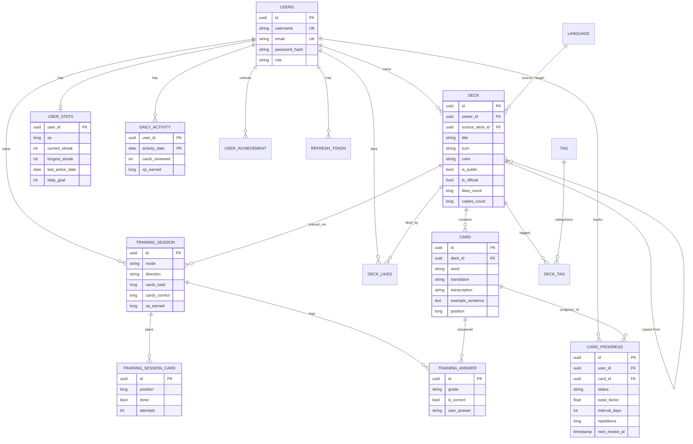

Ключевые решения:

- **Копия колоды** — новая строка `deck` со своими карточками и ссылкой `source_deck_id` на оригинал
  (`ON DELETE SET NULL`): копия живёт независимо, а у оригинала растёт `copies_count`.
- **Прогресс хранится по паре (пользователь, карточка)**, поэтому по чужой публичной колоде можно тренироваться,
  не копируя её, и у каждого свой прогресс.
- **План сессии** (`training_session_card`) фиксирует карточки раунда; забытая карточка уходит в конец очереди
  и повторяется в том же раунде (до 3 попыток).

---

## 🧠 Как работает обучение

**SM-2** (`SpacedRepetition`): оценка → качество ответа (Не помню = 1, Трудно = 3, Хорошо = 4, Легко = 5).

| Повтор | Интервал                                                     |
|--------|--------------------------------------------------------------|
| 1-й    | 1 день (Легко — 3 дня)                                       |
| 2-й    | 6 дней (Трудно — 3, Легко — 8)                               |
| далее  | интервал × ease factor (Трудно × 1.2, Легко — бонус × 1.3)   |
| ошибка | сброс, повтор через 10 минут                                 |

Ease factor меняется по формуле SM-2 и не опускается ниже 1.3. Слово считается **выученным** после трёх
успешных повторов подряд.

**Опыт**: Хорошо — 10 XP, Легко — 12, Трудно — 6, Не помню — 2; ввод и аудирование +4 за верный ответ;
+20 за завершённый раунд, +30 за идеальный (от 10 карточек), +50 за выполненную цель дня.
Уровень N начинается с `50 × N × (N − 1)` XP.

---

## 🔌 API

Полная интерактивная документация — **Swagger UI** (`/swagger-ui.html`). Кратко:

| Метод | Путь | Описание |
|-------|------|----------|
| `POST` | `/api/auth/register`, `/login`, `/refresh`, `/logout` | Регистрация, вход, обновление и отзыв токенов |
| `GET` `PATCH` `DELETE` | `/api/users/me` | Профиль текущего пользователя |
| `PUT` | `/api/users/me/password`, `/api/users/me/settings` | Смена пароля, цель дня |
| `GET` | `/api/languages`, `/api/tags` | Справочники (без авторизации) |
| `GET` `POST` | `/api/decks` | Мои колоды с прогрессом / создать колоду |
| `GET` | `/api/decks/public` | Каталог: `search`, `languageId`, `tagId`, `official`, `sort` (без авторизации) |
| `GET` | `/api/decks/public/{id}/cards` | Предпросмотр публичной колоды (без авторизации) |
| `GET` `PATCH` `DELETE` | `/api/decks/{id}` | Колода |
| `POST` | `/api/decks/{id}/copy` | Скопировать себе |
| `POST` `DELETE` | `/api/decks/{id}/like` | Лайк |
| `GET` | `/api/decks/{id}/progress` | Прогресс по колоде |
| `GET` `POST` | `/api/decks/{id}/cards` | Карточки с прогрессом / добавить |
| `POST` | `/api/decks/{id}/cards/bulk` | Импорт до 1000 карточек |
| `PATCH` `DELETE` | `/api/cards/{id}` | Изменить / удалить карточку |
| `POST` | `/api/training/sessions` | Начать раунд: `mode`, `direction`, `scope`, `limit` |
| `GET` | `/api/training/sessions/{id}/next` | Следующая карточка (`204`, если всё отвечено) |
| `POST` | `/api/training/sessions/{id}/answers` | Ответ: `grade` (карточки) или `answer` (остальные режимы) |
| `POST` | `/api/training/sessions/{id}/finish` | Итоги: бонусы, серия, новые достижения |
| `GET` | `/api/stats/overview`, `/activity`, `/forecast`, `/hard-words`, `/word-of-the-day`, `/achievements` | Статистика |
| `GET` `PATCH` `DELETE` `POST` | `/api/admin/users`, `/api/admin/languages`, `/api/admin/tags` | Админка (роль `ADMIN`) |

---

## 📁 Структура проекта

```
wordmaster/
├── src/main/java/a/slelin/work/word/master/
│   ├── config/          # Security (JWT), свойства приложения, Clock, OpenAPI, создание админа
│   ├── controller/      # REST-контроллеры + GlobalExceptionHandler
│   ├── dto/             # Request/Response records (auth, user, deck, card, training, stats, …)
│   ├── entity/          # JPA-сущности, перечисления и их конвертеры
│   ├── exception/       # Исключения предметной области
│   ├── mapper/          # MapStruct-мапперы
│   ├── repository/      # Spring Data репозитории, Specifications, проекции
│   ├── security/        # Actor, TokenService, JSON-ответы 401/403
│   ├── service/         # Интерфейсы сервисов
│   │   ├── impl/        # Реализации
│   │   └── logic/       # SM-2, проверка ответов, уровни (чистая логика)
│   └── utility/         # Сериализаторы дат, EnumUtil
├── src/main/resources/
│   ├── db/changelog/    # Liquibase: schema/ и data/ (seed)
│   ├── db/seed/         # CSV стартовых колод
│   └── application*.yaml
├── src/test/            # Unit- и интеграционные тесты
├── frontend/            # Vue 3 + TypeScript SPA (src/views, components, stores, api, i18n, styles)
├── Dockerfile           # Образ бэкенда
├── docker-compose.yml   # Всё приложение одной командой (образы из Docker Hub)
├── docker-compose.build.yml  # Сборка образов из исходников
├── docker-compose.dev.yml    # Только PostgreSQL для разработки
└── .github/workflows/   # CI
```

---

## 🧪 Тесты

```bash
mvn verify                    # бэкенд: unit + интеграционные (нужен Docker для Testcontainers)
cd frontend && npm test       # фронтенд: Vitest
cd frontend && npm run build  # проверка типов + сборка
```

- **Unit**: алгоритм SM-2, проверка ответов (опечатки, варианты, «ё», скобки), уровни, логика серии дней и цели.
- **Интеграционные** (Testcontainers + PostgreSQL 17): миграции и seed, безопасность, полный цикл
  «колода → карточки → тренировка → статистика», копирование, лайки и права доступа.

---

## 🗺️ Дорожная карта

### Сделано

- [x] Описание проекта и модель данных
- [x] Слой данных: сущности, DTO, миграции Liquibase, seed-данные
- [x] Сервисы, мапперы, контроллеры, единый формат ошибок
- [x] Spring Security: регистрация, вход, JWT + refresh-токены, роли и права доступа
- [x] Интервальные повторения SM-2 и 4 режима тренировки
- [x] Геймификация: опыт, уровни, цель дня, серия, достижения
- [x] Unit- и интеграционные тесты
- [x] Фронтенд на Vue 3: светлая/тёмная тема, RU/EN, адаптивность, PWA
- [x] Docker / docker-compose, CI на GitHub Actions

### Идеи на будущее

- [ ] Экспорт/импорт колод в формате Anki и CSV-файлы с картинками
- [ ] Загрузка изображений и аудио (S3-совместимое хранилище)
- [ ] Лидерборд по опыту за неделю, друзья и совместные колоды
- [ ] Напоминания (push / email), чтобы не потерять серию
- [ ] Генерация примеров предложений и карточек с помощью ИИ
- [ ] Офлайн-тренировки в PWA с синхронизацией

---

## 🤝 Участие в разработке

1. Форкните репозиторий и создайте ветку: `git checkout -b feature/amazing-feature`
2. Убедитесь, что всё собирается: `mvn verify` и `cd frontend && npm test && npm run build`
3. Создайте Pull Request с описанием изменений

## 📄 Лицензия

Распространяется под лицензией MIT. См. файл [`LICENSE`](LICENSE).
